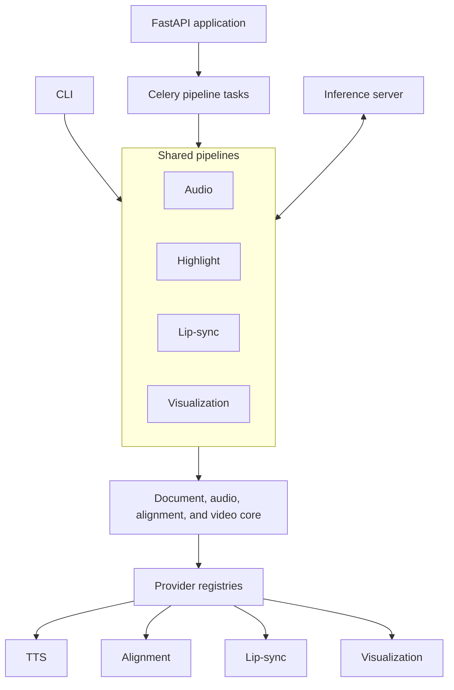
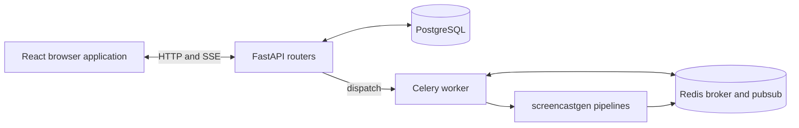

# Architecture

> High-level design of the screencastgen system.

---

## Layer Diagram



---

## Design Principles

### Deferred Imports
Heavy ML dependencies (torch, whisperx, moviepy, qwen-tts) are imported **inside functions**, never at module top level. This lets `screencastgen --help` and [Doctor](../reference/core/doctor.md) run without loading every optional model dependency. Every new provider must follow this pattern.

### Provider Registries
TTS, alignment, lip-sync, and visualization backends are pluggable via registries/factories in `screencastgen/providers/`. Heavy providers use deferred imports so modules are only loaded when they are actually created.

- [TTS Registry](../reference/providers/tts-registry.md) — `create_backend(name, **kwargs)`
- [Alignment Registry](../reference/providers/alignment-registry.md) — `align_with_provider(provider, audio_path, text, ...)`
- [Lipsync Registry](../reference/providers/lipsync-registry.md) — `run_lipsync_provider(provider, video_path, audio_path, ...)`
- [Visualization Registry](../reference/providers/visualization-registry.md) — `create_renderer(name)`

### Resumable Processing
The [Tracker](../reference/core/tracker.md) (`ProcessingTracker`) persists chunk-level state to a JSON file. Chunks are keyed by `chunk_number + MD5 hash`, so content changes invalidate stale entries. The tracker also stores alignment results and video rendering state.

### Byte-Based Sizing
All chunk and sentence sizing uses **UTF-8 byte length** (not character count). Each TTS backend declares its own `max_chunk_bytes` via the [TTSBackend protocol](../reference/core/types.md). [Constants](../reference/core/constants.md) provides system-wide defaults.

### CPU/GPU Split
The `remote` TTS backend ([Remote TTS](../reference/providers/remote-tts.md)) delegates ML work to a [GPU inference server](../reference/core/inference-server.md) over HTTP. The [Remote GPU Client](../reference/core/remote-gpu-client.md) handles alignment and lip-sync offloading too. Remote lip-sync now uses a job-handle protocol: submit work, poll elapsed/status, optionally cancel, download the result, and ask the server to delete temporary output.

### Managed Environment Profiles
[Setup Script](../reference/configuration/setup-script.md) and [Doctor](../reference/core/doctor.md) share the `auto`, `local-gpu`, `remote-client`, and `dev` profile model. Automatic selection uses `local-gpu` only on Linux or WSL2 when `nvidia-smi` can access a GPU; other platforms default to `remote-client`. Setup mutates the managed environment, while doctor only reports active capabilities and exits nonzero for required failures.

### Pluggable Storage
The [Storage Service](../reference/web/backend/storage-service.md) uses a `StorageBackend` ABC with local, GCS, and S3 implementations. Pipelines always work against local directories; remote backends handle uploads/downloads to buckets. Cloud SDKs (`google-cloud-storage`, `boto3`) are deferred imports, following the same pattern as ML deps. Configured via `P2A_STORAGE_BACKEND` env var.

### Structured Events
[PipelineReporter](../reference/pipelines/pipeline-events.md) emits both human-readable console lines and machine-parseable `PipelineEvent` objects. Optional structured `data` carries lip-sync page start/progress/completion details and timings. The web app's [Progress Reporter](../reference/web/backend/progress-reporter.md) persists completed timing state and publishes events to Redis pubsub for SSE delivery to the browser. Hosts can also supply a cooperative `should_cancel` callback.

### Partial Lip-Sync Completion
The web API stores a confirmed lip-sync stop request in Redis. Remote runs forward it to the GPU job; local runs observe it between provider calls. When pages have already completed, the pipeline builds the output from that prefix and records stopped-early counts/timings in result metadata. An empty partial run fails instead of creating an unusable artifact.

### Reader-First Lip-Sync Output
The web lip-sync default is a browser reader bundle instead of a baked composite video. The pipeline concatenates per-page presenter clips into `presenter.mp4`, builds shared reader assets with [Reader Assets](../reference/core/reader-assets.md), and lets the browser combine document text/page images with a draggable/resizable presenter. A baked MP4 can still be exported on demand from the reader.

---

## Module Dependency Graph

```
cli.py
├── pipelines/audio.py
│   ├── pipelines/common.py
│   │   ├── extractor.py
│   │   ├── text_processing.py
│   │   ├── tracker.py
│   │   ├── aligner.py
│   │   │   └── providers/align/
│   │   ├── providers/tts/
│   │   └── remote_gpu.py
│   ├── concatenator.py
│   └── pipelines/events.py
├── pipelines/highlight.py
│   ├── (all of audio dependencies)
│   ├── highlight_renderer.py  (fallback for non-PDF)
│   ├── page_renderer.py       (PDF page-image rendering)
│   ├── word_matcher.py        (WhisperX words → PDF bboxes)
│   ├── video_composer.py
│   └── epub_builder.py
├── pipelines/lipsync.py
│   ├── (all of highlight dependencies)
│   ├── lipsync.py (facade)
│   │   └── providers/lipsync/
│   ├── reader_assets.py
│   └── remote_gpu.py
├── pipelines/visualization.py
│   └── providers/visualization/
├── doctor.py
│   └── environment, model-cache, sidecar, and remote-server checks
└── models.py
    └── providers/tts/ + providers/lipsync/
```

---

## Web Application Stack



See [Web Overview](web-architecture.md) for the full web architecture breakdown.

---

## See Also

- [Data Flow](data-flow.md) — Step-by-step pipeline data flows
- [Pipeline Overview](pipelines.md) — Pipeline design and shared steps
- [Provider Overview](providers.md) — How provider registries work
