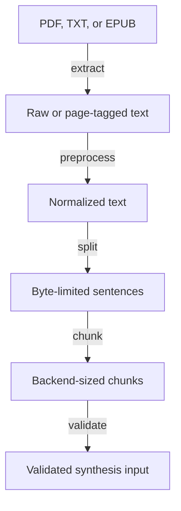
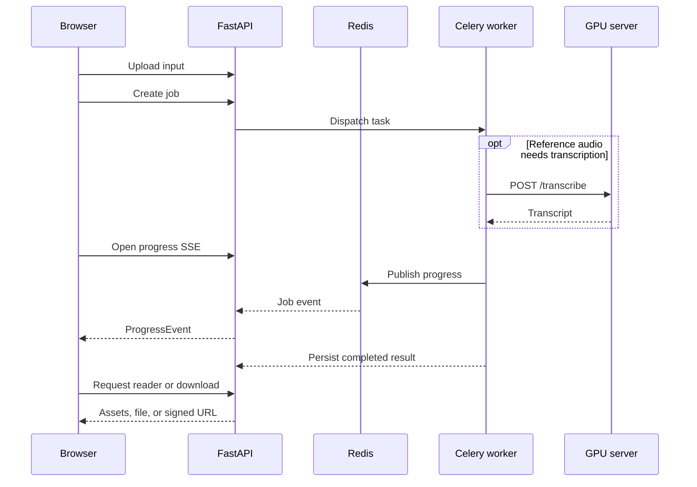
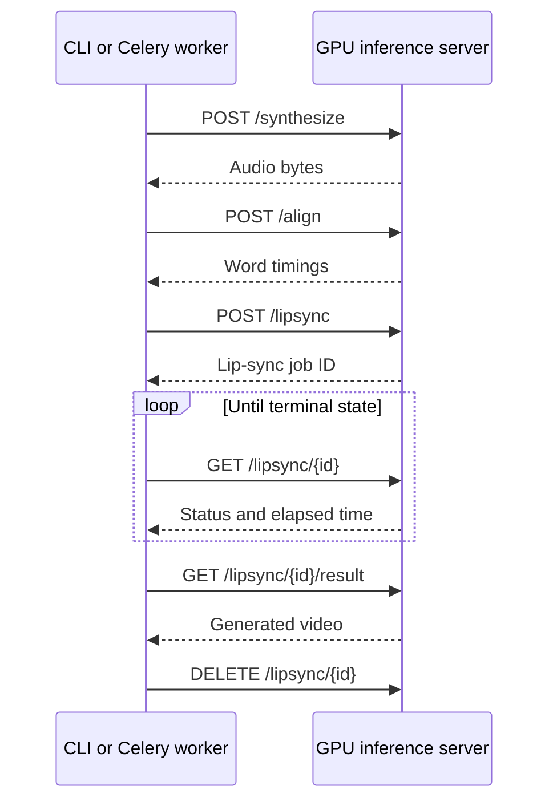

# Data Flow

> Step-by-step data transformations through each pipeline.

---

## Shared Steps (Document Pipelines)

The audio, highlight, and lip-sync pipelines begin with the same extraction and chunking sequence, implemented in [Pipeline Common](../reference/pipelines/pipeline-common.md):



Modules involved: [Extractor](../reference/core/extractor.md) → [Text Processing](../reference/core/text-processing.md) → [Tracker](../reference/core/tracker.md)

---

## Audio Pipeline

```
Validated Chunks
    │
    ▼  backend.synthesize(chunk, path)          ← TTS Registry
audio_chunk_001.wav, audio_chunk_002.wav, ...
    │
    ▼  concatenate(output_dir, dest, ext)        ← Concatenator
output.wav (single merged file)
```

See [Audio Pipeline](../reference/pipelines/audio-pipeline.md) for details.

---

## Highlight Pipeline

```
Validated Chunks + Audio Files
    │
    ▼  align_chunk(audio, text, provider)        ← Aligner
List[AlignedChunk] with List[WordTiming] per chunk
    │
    ├── MP4 (PDF input) ───────────────────────────────────┐
    │   ▼  extract_words_with_bboxes(pdf)  ← Extractor (PyMuPDF)
    │   List[PDFWordInfo] (words + bounding boxes)         │
    │   ▼  match_words_to_bboxes()         ← Word Matcher
    │   WordTiming objects enriched with bbox + page        │
    │   ▼  PageRenderer.render_frame()     ← Page Renderer
    │   PIL Image frames (actual PDF page + highlight)     │
    │   ▼  compose_highlight_video()       ← Video Composer
    │   output.mp4 (PDF pages + highlighted words + audio) │
    │                                                      │
    ├── MP4 (non-PDF) ────────────────────────────────────┐
    │   ▼  HighlightRenderer.render_frame()← Highlight Renderer
    │   PIL Image frames (plain text on dark background)   │
    │   ▼  compose_highlight_video()       ← Video Composer
    │   output.mp4 (text video + audio)                    │
    │                                                      │
    └── EPUB path ─────────────────────────────────────────┐
        ▼  EPUBBuilder.add_chapter()           ← EPUB Builder
        XHTML + SMIL (Media Overlays)
        ▼  EPUBBuilder.build()
        output.epub (word-level audio sync)
```

See [Highlight Pipeline](../reference/pipelines/highlight-pipeline.md) for details.

---

## Lipsync Pipeline

```
AlignedChunks + Reference Video
    │
    ▼  generate_lipsync_video(audio, video)     ← Lipsync Facade or Remote GPU Client
    lipsync_chunk_001.mp4 (lip-synced presenter page)
    │
    ├── Reader path ─────────────────────────────────────┐
    │   ▼ concatenate presenter chunks                    │
    │   presenter.mp4                                     │
    │   ▼ build_reader_assets()          ← Reader Assets
    │   reader_manifest.json + reader_audio.mp3 + pages/ │
    │   ▼ build_offline_reader_archive()                  │
    │   hosted reader assets + standalone reader ZIP      │
    │                                                     │
    ├── EPUB path ───────────────────────────────────────┐
    │   ▼ EPUBBuilder.add_chapter()       ← EPUB Builder
    │   text + narration EPUB (presenter omitted)         │
    │                                                     │
    └── MP4 path ────────────────────────────────────────┐
        ▼ compose_lipsync_video()        ← Video Composer
        output.mp4 (PDF/text + face overlay + audio)
```

See [Lipsync Pipeline](../reference/pipelines/lipsync-pipeline.md) for details.

## Visualization Pipeline

```
Prompt + render config
    │
    ▼  generate_manim_script()
generated_visualization.py
    │
    ▼  create_renderer(provider)            ← Visualization Registry
ManimGLRenderer or ManimCERenderer
    │
    ▼  renderer.render()
visualization.mp4
    │
    ▼  visualization_metadata.json
prompt, generated code, command, log excerpts, render metadata
```

See [Visualization Pipeline](../reference/pipelines/visualization-pipeline.md) for details.

---

## Web Application Flow



See [Web Overview](web-architecture.md), [Pipeline Tasks](../reference/web/backend/pipeline-tasks.md), [Progress Reporter](../reference/web/backend/progress-reporter.md), [Events Router](../reference/web/backend/events-router.md).

---

## Remote GPU Flow

When `--backend remote` is used, ML work is offloaded:



See [Remote GPU Client](../reference/core/remote-gpu-client.md), [Remote TTS](../reference/providers/remote-tts.md), [Inference Server](../reference/core/inference-server.md).

---

## See Also

- [Architecture](architecture.md) — System design overview
- [Pipeline Overview](pipelines.md) — Pipeline orchestration patterns
- [Types](../reference/core/types.md) — Core data structures (`WordTiming`, `AlignedChunk`, `TTSBackend`)
