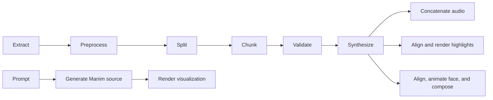

# Pipeline Overview

> How pipelines are structured, their shared steps, and orchestration patterns.

**Source:** [`screencastgen/pipelines/`](https://github.com/ShaShekhar/screencastgen/tree/main/screencastgen/pipelines/)

---

## Pipeline Architecture

The three document pipelines share a common extraction-to-synthesis flow, then diverge for their specific output format. The visualization pipeline is prompt-driven and bypasses document extraction/TTS.



---

## Shared Steps

These are implemented in [Pipeline Common](../reference/pipelines/pipeline-common.md) and used by the document pipelines:

| Step | Function | Module |
|------|----------|--------|
| 1. Extract | `extract_and_chunk()` | [Extractor](../reference/core/extractor.md) |
| 2. Preprocess | (within extract_and_chunk) | [Text Processing](../reference/core/text-processing.md) |
| 3. Split | (within extract_and_chunk) | [Text Processing](../reference/core/text-processing.md) |
| 4. Chunk | (within extract_and_chunk) | [Text Processing](../reference/core/text-processing.md) |
| 5. Validate | `validate_and_collect()` | [Text Processing](../reference/core/text-processing.md) |
| 6. Synthesize | `synthesize_chunks()` | [TTS Registry](../reference/providers/tts-registry.md) |

---

## Pipeline-Specific Steps

### [Audio Pipeline](../reference/pipelines/audio-pipeline.md)
7. Concatenate audio chunks → single file

### [Highlight Pipeline](../reference/pipelines/highlight-pipeline.md)
7. Align chunks (word-level timing)
8. Render frames / Build EPUB

### [Lipsync Pipeline](../reference/pipelines/lipsync-pipeline.md)
7. Align chunks
8. Generate lip-sync videos per chunk
9. Build reader bundle, EPUB, or composite MP4

### [Visualization Pipeline](../reference/pipelines/visualization-pipeline.md)
1. Generate a Manim scene from a prompt
2. Render with a selected visualization provider
3. Persist MP4 output plus metadata/source artifacts

---

## Request/Result Pattern

Each pipeline accepts a typed request dataclass and returns a [PipelineRunResult](../reference/pipelines/pipeline-types.md):

```python
def run_audio_pipeline(request: AudioPipelineRequest, reporter, backend_factory) -> PipelineRunResult
def run_highlight_pipeline(request: HighlightPipelineRequest, reporter, backend_factory) -> PipelineRunResult
def run_lipsync_pipeline(request: LipsyncPipelineRequest, reporter, backend_factory) -> PipelineRunResult
def run_visualization_pipeline(request: VisualizationPipelineRequest, reporter, renderer) -> PipelineRunResult
```

See [Pipeline Types](../reference/pipelines/pipeline-types.md) for the request hierarchy.

---

## Event Reporting

All pipelines use [PipelineReporter](../reference/pipelines/pipeline-events.md) for progress output:
- `reporter.line(message)` — Human-readable console output
- `reporter.emit(phase, current, total, message)` — Structured event
- `reporter.phase_start(phase, message)` — Phase transition
- `reporter.cancelled()` — Host-requested early stop check used by long-running lip-sync work

The web app's [Progress Reporter](../reference/web/backend/progress-reporter.md) subscribes to these events.

---

## Module Structure

```
screencastgen/pipelines/
├── __init__.py          (public exports)
├── types.py             Pipeline Types
├── events.py            Pipeline Events
├── common.py            Pipeline Common
├── audio.py             Audio Pipeline
├── highlight.py         Highlight Pipeline
├── lipsync.py           Lipsync Pipeline
└── visualization.py     Visualization Pipeline
```

---

## See Also

- [Architecture](architecture.md) — System-level design
- [Data Flow](data-flow.md) — Step-by-step data transformations
- [CLI](../reference/core/cli.md) — Dispatches to pipeline runners
- [Pipeline Tasks](../reference/web/backend/pipeline-tasks.md) — Web worker invocation
