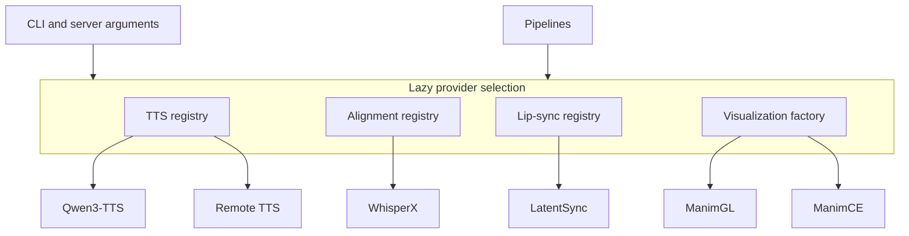

# Provider Overview

> How the pluggable provider registries work.

**Source:** [`screencastgen/providers/`](https://github.com/ShaShekhar/screencastgen/tree/main/screencastgen/providers/)

---

## Registry Pattern

screencastgen uses registry/factory patterns for TTS, alignment, lip-sync, and visualization providers. ML-heavy backends are lazily imported, so provider modules are only loaded when the backend is actually created.

---

## How It Works

1. TTS, alignment, and lip-sync providers define specs with metadata such as name, module path, class/function name, capabilities, and extra parser args.
2. The registry module stores `name -> spec`; visualization currently uses a direct factory with the same named-provider shape.
3. `create_backend(name)` or the equivalent registry helper imports or instantiates the provider only when needed.
4. Parser helpers register backend-specific CLI or server arguments by context.

This keeps `screencastgen --help` usable without requiring ML dependencies to be installed.

---

## Provider Types

### TTS Backends

Implement the [TTSBackend](../reference/core/types.md) protocol and are registered in [TTS Registry](../reference/providers/tts-registry.md).

| Backend | Class | Contexts | Key Capability |
|---------|-------|----------|----------------|
| [Qwen Backend](../reference/providers/qwen-backend.md) | `QwenTTS` | `cli`, `server` | Multi-language TTS and batched server synthesis |
| [Remote TTS](../reference/providers/remote-tts.md) | `RemoteTTS` | `cli` | HTTP proxy to GPU server |

### Alignment Providers

Registered in [Alignment Registry](../reference/providers/alignment-registry.md).

| Provider | Function | Description |
|----------|----------|-------------|
| [WhisperX Provider](../reference/providers/whisper-x-provider.md) | `align_with_whisperx()` | Word-level alignment via WhisperX |

### Lipsync Providers

Registered in [Lipsync Registry](../reference/providers/lipsync-registry.md).

| Provider | Function | Description |
|----------|----------|-------------|
| [LatentSync Provider](../reference/providers/latent-sync-provider.md) | `run_latentsync()` | High-quality lip-sync |

### Visualization Renderers

Registered in [Visualization Registry](../reference/providers/visualization-registry.md).

| Renderer | Class | Description |
|----------|-------|-------------|
| [ManimGL Renderer](../reference/providers/manim-gl-renderer.md) | `ManimGLRenderer` | Primary ManimGL subprocess adapter |
| [ManimCE Renderer](../reference/providers/manim-ce-renderer.md) | `ManimCERenderer` | Command builder placeholder; rendering intentionally disabled |

---

## See Also

- [Architecture](architecture.md) — System-level design
- [TTS Base](../reference/providers/tts-base.md) — Spec dataclass definitions
- [Pipeline Common](../reference/pipelines/pipeline-common.md) — Creates and uses backends
