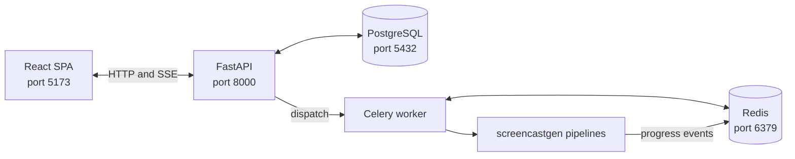

# Web Overview

> Full-stack web application wrapping document pipelines and prompt-driven visualization jobs.

**Stack:** FastAPI + PostgreSQL + Celery/Redis + React/Tailwind

---

## Architecture



---

## Backend Structure

```
web/backend/
├── main.py              FastAPI App
├── config.py            Web Config
├── database.py          Web Database
├── models.py            DB Models
├── schemas.py           Schemas
├── logging_config.py    Web Logging
├── routers/
│   ├── uploads.py       Uploads Router
│   ├── jobs.py          Jobs Router
│   ├── events.py        Events Router
│   ├── reader.py        Reader Router
│   └── voices.py        Voices Router
├── services/
│   ├── storage.py           Storage Service (delegation + singleton)
│   ├── storage_backend.py   Storage Service (ABC + Local/GCS/S3 backends)
│   ├── transcribe_client.py Transcribe Client
│   └── voices.py            Voices Service
└── tasks/
    ├── celery_app.py    Celery App
    ├── pipelines.py     Pipeline Tasks
    └── progress.py      Progress Reporter
```

---

## Frontend Structure

See [Frontend Overview](../reference/web/frontend/frontend-overview.md) for details.

```
web/frontend/src/
├── App.tsx              (routing)
├── types/index.ts       (TypeScript types)
├── api/                 (API client layer)
├── hooks/               (React hooks)
├── components/          (reusable UI)
└── pages/               (route pages)
```

---

## Key Flows

### Job Creation
1. Upload document → [Uploads Router](../reference/web/backend/uploads-router.md) → [Storage Service](../reference/web/backend/storage-service.md) for document jobs; visualization jobs start from a prompt
2. Create job → [Jobs Router](../reference/web/backend/jobs-router.md) → [Job record](../reference/web/backend/db-models.md) → [Celery dispatch](../reference/web/backend/pipeline-tasks.md)

### Job Execution
1. [Worker](../reference/web/backend/celery-app.md) picks up task
2. [Pipeline Tasks](../reference/web/backend/pipeline-tasks.md) constructs request + runs pipeline
3. [Progress Reporter](../reference/web/backend/progress-reporter.md) publishes events to Redis pubsub

### Real-Time Progress
1. Browser opens SSE connection → [Events Router](../reference/web/backend/events-router.md)
2. Events Router subscribes to Redis pubsub channel
3. [Progress Reporter](../reference/web/backend/progress-reporter.md) publishes pipeline events
4. Browser receives `ProgressEvent` via SSE; lip-sync events include structured per-page timing data

### Stop A Lip-Sync Run
1. The user selects **Stop & build from completed pages** in [LipsyncRunPanel](../reference/web/frontend/lipsync-run-panel.md)
2. The browser displays an inline warning; no request is sent yet
3. **Keep running** dismisses the warning, while **Yes, stop and build** calls `POST /api/jobs/{id}/stop` through [Jobs Router](../reference/web/backend/jobs-router.md)
4. The API writes a Redis cancellation flag and the worker observes it through [Progress Reporter](../reference/web/backend/progress-reporter.md)
5. When at least one page completed, the pipeline builds and labels a shortened output

### Job Download
1. Browser requests download → [Jobs Router](../reference/web/backend/jobs-router.md)
2. [Storage Service](../reference/web/backend/storage-service.md) serves the file:
   - **Local backend:** `FileResponse` from `outputs/{job_id}/`
   - **GCS/S3 backend:** `RedirectResponse` to a signed URL

### Browser Reader And Export
1. Completed highlight/lip-sync jobs expose reader assets through [Reader Router](../reference/web/backend/reader-router.md)
2. [Reader Page](../reference/web/frontend/reader-page.md) streams the manifest, audio, page images, and optional presenter video
3. The primary job download is a standalone reader ZIP that opens without the web service
4. Lip-sync reader jobs can request `export-epub` for a text-and-narration accessibility export

---

## Running

### Docker
```bash
cd web && docker compose up --build
# Frontend: http://localhost:5173
# API: http://localhost:8000
```

### Local Dev
```bash
cd web && cp .env.example .env
make install && make migrate
# Terminal 1: make backend
# Terminal 2: make worker
# Terminal 3: make frontend
```

---

## See Also

- [Architecture](architecture.md) — System-level design
- [Data Flow](data-flow.md) — Web application flow diagram
- [Docker Compose](../reference/configuration/docker-compose.md) — Container orchestration
- [Web Makefile](../reference/configuration/web-makefile.md) — Development targets
- [Frontend Overview](../reference/web/frontend/frontend-overview.md) — React SPA details
