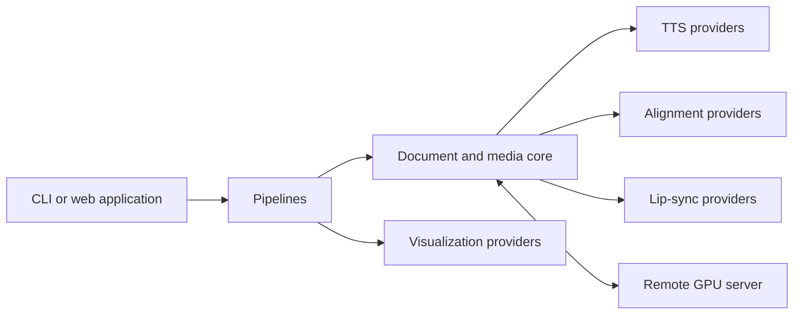

# screencastgen

Build narrated document experiences from PDF, EPUB, and plain-text sources.
screencastgen can generate audio, synchronized highlighting, lip-synced
presenters, browser reader bundles, and educational animations.

## Choose a workflow

| Goal | Start here |
| --- | --- |
| Install and verify the project | [Getting started](getting-started/index.md) |
| Generate narrated audio | [Audio guide](guides/audio.md) |
| Highlight words in sync with narration | [Highlight guide](guides/highlight.md) |
| Add a lip-synced presenter | [Lip-sync guide](guides/lip-sync.md) |
| Generate an educational animation | [Visualization guide](guides/visualization.md) |
| Run the browser application | [Web application guide](guides/web-application.md) |
| Split processing across CPU and GPU hosts | [Remote GPU guide](guides/remote-gpu.md) |

## How the project fits together

The CLI and web application call a shared set of pipelines. Provider registries
select the TTS, alignment, lip-sync, and visualization implementations. A remote
GPU server can run model-heavy operations while a client performs document and
media processing.

Read the [architecture overview](concepts/architecture.md) for the complete
design or browse the [developer reference](reference/index.md) for individual
modules and services.

## How it works

Document pipelines share the same extraction-to-speech foundation:

1. Extract text from the source document.
2. Preprocess text to fix common PDF and document artifacts.
3. Split text into sentences and backend-sized chunks.
4. Validate chunks before synthesis.
5. Generate narration with the selected TTS provider.
6. Concatenate synthesized chunks into a complete audio track.

Highlight and lip-sync outputs add word-level alignment after synthesis. PDF
inputs use page images plus PyMuPDF word positions for precise highlighting;
other document formats use a reflowed text renderer. Lip-sync outputs then
animate the reference presenter with the selected face-animation provider and
package the result as a LipSync Reader or EPUB depending on the requested
format. The offline reader ZIP is the recommended portable output.

The same provider abstraction works locally or against a remote GPU server:
client-side document processing stays on the CPU host, while model-heavy TTS,
alignment, and lip-sync work can run remotely.

## Supported implementations

- **Text to speech:** Qwen3-TTS locally, or the remote TTS client
- **Word alignment:** WhisperX
- **Lip synchronization:** LatentSync
- **Visualization:** ManimGL, with a Manim Community adapter placeholder
- **Web stack:** FastAPI, PostgreSQL, Celery/Redis, React, and Tailwind CSS

## Project resources

- [Source repository](https://github.com/ShaShekhar/screencastgen)
- [Installation guide](getting-started/installation.md)
- [Troubleshooting](troubleshooting.md)
